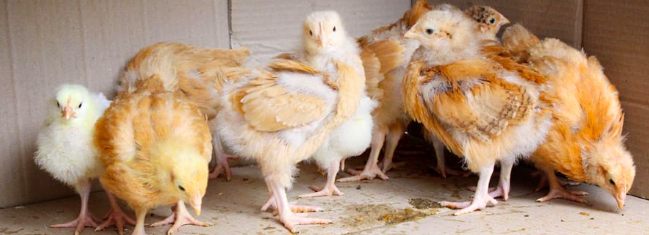

# Coccidiosis Classification Project


Welcome to the **Coccidiosis Classification Project**. This project aims to classify chicken diseases, specifically coccidiosis, using machine learning techniques.



## Table of Contents
- [Introduction](#introduction)
- [Installation](#installation)
- [Usage](#usage)
- [DVC Workflow](#dvc-workflow)
- [MLflow Tracking](#mlflow-tracking)
- [Deployment](#deployment)
  - [AWS CI/CD Deployment](#aws-cicd-deployment)
  - [Azure CI/CD Deployment](#azure-cicd-deployment)
- [Contributing](#contributing)
- [License](#license)

## Introduction

This project leverages convolutional neural networks (CNNs) for the classification of coccidiosis in chickens. It involves data preprocessing, model training, and deployment using various tools and frameworks like DVC, MLflow, Docker, and cloud platforms.

## Installation

To get started, clone the repository and set up the conda environment:

```sh
git clone https://github.com/saran-nair/Coccidiosis-Classification--Project
cd Coccidiosis-Classification--Project
conda create -n cnncls python=3.8 -y
conda activate cnncls
pip install -r requirements.txt
```

## Usage

Run the main application:
```sh
python app.py
```

Access the local host and port to interact with the application.

## DVC Workflow

Initialize and run DVC commands:
```sh
dvc init
dvc repro
dvc dag
```

## MLflow Tracking

Start the MLflow UI:
```sh
mlflow ui
```

## DAGsHub Integration

```sh
export MLFLOW_TRACKING_URI=https://dagshub.com/yourusername/Coccidiosis-Classification-Project.mlflow
export MLFLOW_TRACKING_USERNAME=yourusername
export MLFLOW_TRACKING_PASSWORD=yourpassword
python script.py
```

## Deployment

### AWS CI/CD Deployment

Login to AWS console and create an IAM user with EC2 and ECR access.

Build and push Docker image:
```sh
docker build -t 566373416292.dkr.ecr.us-east-1.amazonaws.com/coccidiosis .
docker push 566373416292.dkr.ecr.us-east-1.amazonaws.com/coccidiosis
```

Launch EC2 instance and install Docker:
```sh
sudo apt-get update -y
sudo apt-get install -y docker.io
sudo usermod -aG docker $USER
newgrp docker
```

Configure EC2 as a self-hosted runner:

Follow the steps in GitHub settings to add the runner.

Setup GitHub secrets:
```sh
AWS_ACCESS_KEY_ID=
AWS_SECRET_ACCESS_KEY=
AWS_REGION=us-east-1
AWS_ECR_LOGIN_URI=566373416292.dkr.ecr.us-east-1.amazonaws.com
ECR_REPOSITORY_NAME=coccidiosis
```

### Azure CI/CD Deployment

Build and push Docker image:
```sh
docker build -t yourregistry.azurecr.io/coccidiosis:latest .
docker login yourregistry.azurecr.io
docker push yourregistry.azurecr.io/coccidiosis:latest
```

Deploy to Azure:

Launch the Web App Server.
Pull the Docker image and run it on the server.

## About MLflow & DVC

**MLflow**:
- A robust platform for tracking experiments.
- Provides logging and tagging of models.

**DVC**:
- Lightweight experiment tracker.
- Suitable for pipeline orchestration.

## Contributing

Contributions are welcome! Please fork the repository and create a pull request.

## License

This project is licensed under the MIT License. See the LICENSE file for details.
